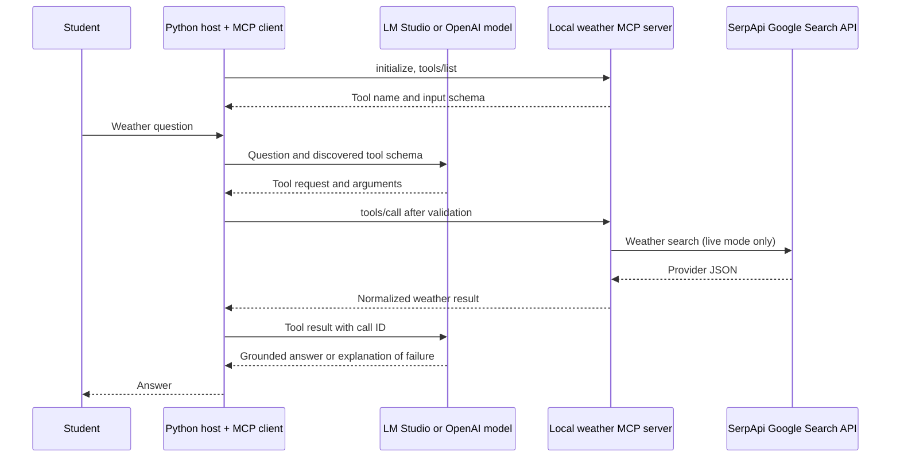

# Weather agents and MCP — two-hour workshop

**Primary classroom route: [Google Colab notebook and instructions](colab/README.md).** Students use the self-contained notebook with OpenAI; the local-computer LM Studio commands below are an optional alternative.

**One question, three implementations, two model options.** Start with ordinary HTTP, give a model a weather tool, then expose that tool through MCP. The original folders and ZIP files remain untouched. This is a separate classroom edition.

Read [the review](REVIEW.md), prepare with [setup](SETUP.md), teach from [the timed program](FACILITATOR.md), and give students [the workbook](WORKBOOK.md). Verification scope is in [VALIDATION.md](VALIDATION.md).

## Intended outcome

Students can explain and demonstrate that a model requests a tool call, application code executes it, and the model receives the result. They can identify what MCP standardizes and run the same weather exercise with LM Studio or OpenAI.

Assumptions: students can open a terminal, run Python, and recognize a function and JSON object. They run and make small variations to supplied code; building an agent framework from scratch is outside these two hours. Python, dependencies, credentials and model downloads are pre-class work. Obsidian is optional.

## Exactly 120 minutes

| Minutes | Activity | Evidence students produce |
|---|---|---|
| 0–10 | Weather problem; model versus agent | Identify why a model needs external data |
| 10–25 | Lab 1: direct weather API | Locate request parameters and normalized result |
| 25–50 | Lab 2: function-calling agent | Trace request → execution → result → answer |
| 50–55 | Break | — |
| 55–70 | MCP roles and comparison | Draw host, client, server and provider |
| 70–100 | Lab 3: actual MCP discovery and execution | Find `tools/list`, schema and `tools/call` |
| 100–113 | Pair challenge and failure exercise | Explain backend substitution and safe failure |
| 113–120 | Exit assessment and recap | Answer the five exit questions |

## Local-computer alternative — run first after setup

From this folder, using its virtual environment:

```bash
python 01_direct_serpapi_api.py --sample
python 02_custom_tool_agent.py --offline
python 03_mcp_agent.py --inspect
python 03_mcp_agent.py --offline
```

These commands do not contact OpenAI, LM Studio or SerpApi. Lab 3 still runs a **real local MCP server and client**. `--offline` substitutes fixed Tokyo model requests and sample weather, and skips a generated final answer. It does not interpret a custom question.

For a real model, choose either backend:

```bash
python 02_custom_tool_agent.py --provider lmstudio --mock-weather --force-tool
python 03_mcp_agent.py --provider lmstudio --mock-weather --force-tool
```

```bash
python 02_custom_tool_agent.py --provider openai --mock-weather --force-tool
python 03_mcp_agent.py --provider openai --mock-weather --force-tool
```

`--mock-weather` still calls the selected model service. Remove it only when using live SerpApi data with `SERPAPI_KEY` configured. `--force-tool` is an instructional control: the host requires the first call; it is not evidence that the model independently chose to use a tool. Without this flag, tool selection is automatic. The host withholds a weather answer if no tool was executed.

## What changes

| Responsibility | Direct API | Custom tool agent | Local MCP agent |
|---|---|---|---|
| Model inference | None | LM Studio or OpenAI | LM Studio or OpenAI |
| Weather schema | Python parameters | Host defines JSON schema | Server advertises schema; host discovers it |
| Tool execution | Direct function call | Host dispatches Python function | Host's MCP client sends `tools/call`; server runs function |
| Provider HTTP and normalization | Adapter in app process | Adapter in app process | Adapter in server process |
| Agent conversation and limits | None | Host | Host |
| Weather API remains underneath | Yes | Yes | Yes |



In sample mode, the server supplies labelled demonstration data instead of contacting SerpApi. The model connection uses Chat Completions for both backends to keep this comparison small. MCP is on the host-to-server connection; the model endpoint does not need native MCP support. OpenAI does not directly connect to the local stdio server.

## File map

- `01_direct_serpapi_api.py`: original direct-API lesson copied with its fixture.
- `02_custom_tool_agent.py`: direct-dispatch entry point.
- `03_mcp_agent.py`: stdio lifecycle, discovery and MCP dispatch.
- `agent_core.py`: shared model selection, conversation and execution budget.
- `weather_contract.py`: direct schema, validation and credential scrubbing.
- `weather_mcp_server.py`: small MCP server exposing one tool.
- `serpapi_weather.py`: original adapter with provider-error body suppression added in this copy.
- `tests/`: provider tests, host boundary tests and real stdio integration test.
- `requirements.txt`: compatible dependency ranges; `requirements-tested.txt`: installed versions from this verification run.

## Next lesson, after these two hours

Use the original `lmstudio_serpapi_api_to_mcp/03_serpapi_mcp_agent.py` to compare a provider-hosted remote MCP server with this local server. In that example LM Studio's native host manages the loop. Here Python manages the loop. This is a hosting choice, not a rule of MCP. Then explore one business role from `serpapi-agent-workshop`, or replace SerpApi with the AccuWeather adapter as an engineering exercise.

## Technical references

Verified against official documentation on 10 September 2026:

- [OpenAI function calling](https://developers.openai.com/api/docs/guides/function-calling): tool request, application execution and result return.
- [GPT-4.1 mini](https://developers.openai.com/api/docs/models/gpt-4.1-mini): the configurable default supports function calling and Chat Completions. Account access must be checked before class.
- [Official MCP Python SDK, v1 branch](https://github.com/modelcontextprotocol/python-sdk/tree/v1.x): server and client APIs. This package deliberately requires `mcp<2`.

The shared Chat Completions interface is a teaching choice for backend parity, not a recommendation to use it for every new OpenAI application.
